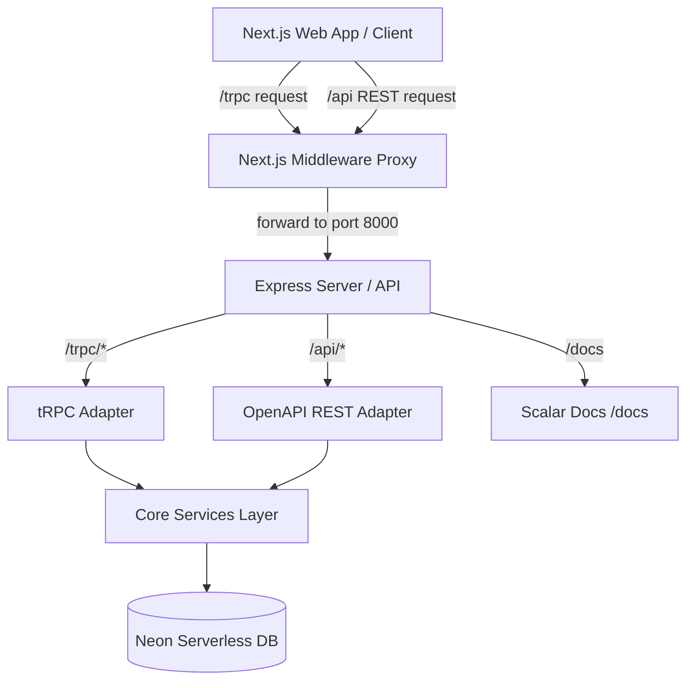

# Patra.io — Forms that feel like conversations 💬

Patra.io is a conversational form builder. It enables creators to build beautiful, highly interactive forms with step-by-step question interfaces, rich customizable themes, robust analytics, and REST API access. Built using a modern monorepo architecture, it offers performance-optimized server-side rendering, sub-second transitions, and real-time submission tracking.

---

## ✨ Features

- **Conversational Form Builder**: Create conversational forms with step-by-step slides. Supports form blocks like `welcome`, `short_text`, `long_text`, `multiple_choice`, `checkbox`, `dropdown`, `rating`, `date`, `email`, `number`, `file_upload`, and `thank_you`.
- **Advanced Theme Designer**: Customize branding colors (primary, secondary, background, text, accent), fonts (Outfit, Inter, Roboto, Share Tech Mono, Space Grotesk, Plus Jakarta Sans), and border radius. Includes 8 beautiful system-provided presets.
- **Detailed Analytics Dashboard**: Real-time insights including total views, submissions, response rates, feature breakdowns, and full data grids for answers.
- **REST & tRPC Architecture**: Next.js client interacts over a native tRPC router, while developers get direct access to RESTful API endpoints auto-documented via Swagger.

---

## 🛠️ Tech Stack

- **Monorepo Manager**: [Turborepo](https://turbo.build/) & [pnpm workspaces](https://pnpm.io/workspaces)
- **Frontend App**: [Next.js](https://nextjs.org/) (App Router, Turbopack, React 19)
- **Backend API**: Node.js, [Express](https://expressjs.com/), [tRPC Server](https://trpc.io/)
- **API Documentation**: [trpc-to-openapi](https://github.com/jlalmes/trpc-to-openapi) & [Scalar API Reference](https://scalar.com/)
- **Database Layer**: [Neon Serverless PostgreSQL](https://neon.tech/) & [Drizzle ORM](https://orm.drizzle.team/)
- **Authentication**: JWT (HMAC sha256 + random salt) with Next.js Middleware route guards
- **Styling & Icons**: Vanilla CSS & Tailwind CSS, [Lucide React](https://lucide.dev/), and [Framer Motion](https://www.framer.com/motion/)

---

## 📂 Monorepo Structure

```
├── apps/
│   ├── api/                 # Express backend server (tRPC & OpenAPI endpoints)
│   └── web/                 # Next.js frontend client & builder UI
├── packages/
│   ├── database/            # Neon PostgreSQL connection, Drizzle schemas, & seeds
│   ├── trpc/                # Shared tRPC routers, inputs, schemas, and client utils
│   ├── services/            # Hashing, JWT, DB models, and core SaaS business logic
│   ├── typescript-config/   # Shared tsconfig profiles
│   ├── eslint-config/       # Linting presets
│   └── logger/              # Shared debugging logs library
├── package.json             # Monorepo scripts & dependencies configuration
├── turbo.json               # Turborepo task pipeline configuration
└── pnpm-workspace.yaml      # Monorepo workspace declarations
```

---

## 📐 Architecture



---

## 🗄️ Database Schema & Models

Patra.io uses Drizzle ORM mapped to PostgreSQL tables:

### 1. `users` Table
- `id` (UUID, Primary Key)
- `name` (varchar 80)
- `email` (varchar 255, Unique)
- `role` (varchar 20, default: `"creator"`)
- `plan` (varchar 20, default: `"free"`)
- `password` (text, Hashed)
- `salt` (text)
- `createdAt` & `updatedAt`

### 2. `themes` Table
- `id` (UUID, Primary Key)
- `name` (varchar 100)
- `creatorId` (FK users.id, Cascade)
- `colors` (JSONB: primary, secondary, background, text, accent)
- `fontFamily` (varchar 100)
- `borderRadius` (varchar 20)
- `isSystem` (boolean)

### 3. `forms` Table
- `id` (UUID, Primary Key)
- `creatorId` (FK users.id, Cascade)
- `title` (varchar 255)
- `description` (text)
- `slug` (varchar 100, Unique)
- `visibility` (`"public"` | `"unlisted"` | `"private"`)
- `status` (`"draft"` | `"published"`)
- `themeId` (FK themes.id, Set Null)
- `settings` (JSONB: maxResponses, showProgressBar)

### 4. `fields` Table
- `id` (UUID, Primary Key)
- `formId` (FK forms.id, Cascade)
- `type` (varchar 50: `short_text`, `rating`, `dropdown`, etc.)
- `label` (text), `description` (text), `placeholder` (text)
- `required` (boolean)
- `order` (integer)
- `options` (JSONB)
- `validations` (JSONB: minLength, maxLength, min, max)
- `conditionalRules` (JSONB)
- `properties` (JSONB: maxRating, shape)
---

## 🔒 Authentication Flow
1. **Sign Up/Login**: Password checked via SHA-256 HMAC + Salt validation.
2. **Tokens**: JWT signed by backend using `JWT_SECRET` and returned to frontend client.
3. **Session Cookie**: Auth hook sets a lightweight `patra_logged_in` cookie.
4. **Middleware Protection**: Next.js route middleware reads the `patra_logged_in` cookie server-side, redirecting unauthorized traffic requesting `/dashboard` or `/forms` directly to `/login`.

---

## 🔌 API Routes (OpenAPI Auto-Docs)

Our Express server exposes OpenAPI-compliant REST endpoints alongside the tRPC server. 
You can view the full interactive playground and try endpoints under the **/docs** route.

### Key API Actions:
- **Authentication**: `POST /api/authentication/register`, `POST /api/authentication/login`, `GET /api/authentication/me`
- **Forms**: `GET /api/form.list`, `POST /api/form.create`, `PATCH /api/form.update`
- **Submissions**: `POST /api/submission.create`, `GET /api/submission.listByForm`

---

## ⚙️ Environment Variables

Copy the `.env` template variables into your workspace root `.env` file:

```env
# Database Settings
DATABASE_URL=postgresql://<username>:<password>@<host>/neondb?sslmode=require

# Server Config
PORT=8000
BASE_URL=http://localhost:8000
NODE_ENV=development

# Authentication Secrets
JWT_SECRET=your-64-character-production-secret
JWT_EXPIRES_IN=7d

# Frontend API URL Proxy
NEXT_PUBLIC_API_URL=http://localhost:8000/trpc

# OAuth Settings (Optional)
GOOGLE_OAUTH_CLIENT_ID=your-google-client-id
GOOGLE_OAUTH_CLIENT_SECRET=your-google-client-secret
GOOGLE_OAUTH_REDIRECT_URI=http://localhost:8000/oauth2callback
```

---

## 🚀 Setup & Local Development

Make sure you have [Node.js](https://nodejs.org/) (>= 18) and [pnpm](https://pnpm.io/) installed.

### 1. Install Dependencies
```bash
pnpm install
```

### 2. Database Migrations & Seeds
Push migrations to your Neon database and run the seeds to populate system templates and a demo account:
```bash
# Push schema migrations
pnpm db:generate
pnpm db:migrate

# Seed initial themes, a user, 3 forms, and 70 submissions
pnpm db:seed
```

### 3. Run Development Servers
Start Turborepo's parallel dev server. It spins up the frontend web app on `http://localhost:3000` and the Express API backend on `http://localhost:8000`:
```bash
pnpm dev
```

### 4. Code Formatting & TypeScript Checks
```bash
# Run lint checks
pnpm lint

# Run prettier formatting
pnpm format

# Verify typescript compiling
pnpm check-types
```

---

## 🔑 Demo Account Credentials

Use the following seeded credentials to explore the dashboard immediately:
- **Email**: `demo@patra.io`
- **Password**: `password123`

---

## 🐳 Build & Production Deployment

To compile and optimize the monorepo packages for deployment:
```bash
pnpm build
```

### Deployment Configuration Tips:
- **Frontend (Vercel)**: Point your build configuration to the `apps/web` workspace. Ensure you set `NEXT_PUBLIC_API_URL` to point to your live backend endpoint `/trpc`.
- **Backend (Render / Railway)**: Point to `apps/api`. Set your `NODE_ENV` to `production` and configure a unique `JWT_SECRET` in environment settings.
